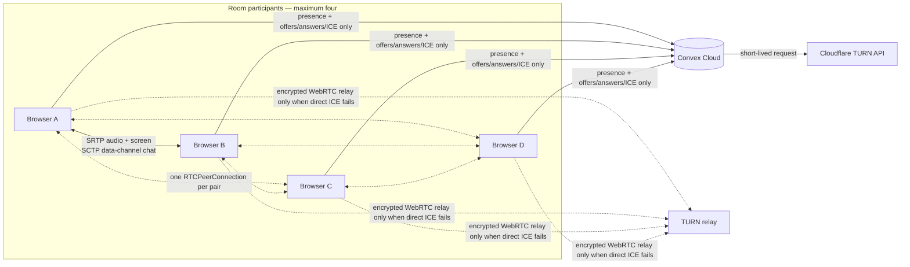

# MeshMeet

MeshMeet is an open-source, browser-based meeting MVP for up to four people. It provides voice, screen sharing, and ephemeral text chat without camera tiles, accounts, recording, analytics, or a media server.

The working name is centralized in [`src/lib/config/brand.ts`](src/lib/config/brand.ts), so rebranding does not require hunting through the application.

## Architecture



Each participant pair owns one `RTCPeerConnection`, so a four-person room has six connections. Microphone and screen tracks use WebRTC media; messages use one ordered, reliable `RTCDataChannel` per pair. Every message is sent separately to each currently connected peer.

Convex carries only:

- room authorization and expiration;
- low-frequency presence and screen-sharing status;
- addressed, expiring WebRTC offers, answers, ICE batches, and renegotiation requests;
- server-side requests for short-lived TURN credentials.

Convex never receives media or chat. Chat is never stored in Convex, Web Storage, IndexedDB, logs, or analytics. A refresh creates a new empty in-memory chat session, and late joiners do not get history.

STUN helps browsers discover direct routes. Some corporate, mobile, or symmetric-NAT networks cannot establish one; TURN then relays the already encrypted WebRTC packets. TURN is therefore part of connectivity, not application signaling or chat storage.

## Technology

- Svelte 5, SvelteKit, strict TypeScript
- `@sveltejs/adapter-static`
- Convex Cloud and `convex-svelte`
- native `RTCPeerConnection`, media capture, and `RTCDataChannel`
- Vitest and Playwright
- ESLint, Prettier, and pnpm

## Local development

Prerequisites: Node.js 22 LTS or newer and pnpm 10 or newer.

```bash
pnpm install
pnpm convex:dev
pnpm dev
```

The first `pnpm convex:dev` opens the Convex login/setup flow, creates a development deployment, deploys the schema and functions, and writes `CONVEX_DEPLOYMENT` plus `PUBLIC_CONVEX_URL` to the local environment file. Keep it running beside the SvelteKit dev server.

For UI-only work with no Convex URL, MeshMeet falls back to a same-origin `BroadcastChannel` adapter and STUN-only ICE. That adapter is deliberately limited to local tabs in one browser profile and must not be used in production. Playwright uses a separate, test-only WebSocket signaling harness so independent browser contexts can be exercised without cloud credentials.

Useful commands:

```bash
pnpm dev                 # frontend development server
pnpm convex:dev          # Convex development deployment
pnpm check               # Svelte and TypeScript checks
pnpm lint                # Prettier check and ESLint
pnpm test:unit           # Vitest suite
pnpm exec playwright install chromium
pnpm test:e2e            # multi-context browser tests
pnpm test                # unit and browser tests
pnpm build               # static production output in build/
pnpm preview             # preview the production build
```

## Convex setup and environment variables

Copy `.env.example` to `.env.local` only if the Convex CLI did not create one:

```bash
cp .env.example .env.local
```

`PUBLIC_CONVEX_URL` is the only browser-visible deployment value. It is intentionally public and contains no credential. `CONVEX_DEPLOYMENT` is used by the CLI and must not be exposed through a `PUBLIC_` name.

Cloudflare TURN secrets belong in the Convex deployment environment, never in the frontend host:

```bash
pnpm exec convex env set CLOUDFLARE_TURN_KEY_ID your-key-id
pnpm exec convex env set CLOUDFLARE_TURN_API_TOKEN your-api-token
```

Create a TURN key in Cloudflare Realtime first. MeshMeet's Convex action calls Cloudflare's `generate-ice-servers` endpoint with a 12-hour TTL matching the maximum room lifetime. The browser receives only the returned short-lived username, credential, and ICE URLs. If either server environment variable is absent or the request fails, the client continues with `stun:stun.cloudflare.com:3478` and logs a visible developer warning.

Never set the TURN key or API token on Netlify, Vercel, GitHub Pages, Cloudflare Pages, or in a variable prefixed with `PUBLIC_`.

## Room security and lifecycle

- The browser creates 128-bit public room IDs, 256-bit room secrets, 128-bit peer IDs, and 256-bit participant session tokens with `crypto.getRandomValues()`.
- Invitations use `/room/<public-id>#<secret>`. URL fragments are not part of HTTP requests to the static host.
- The browser sends Convex only a SHA-256 hash of the room secret. Every public room query, mutation, signal operation, and TURN authorization checks that hash.
- A peer ID is an address, not authentication. Each participant also proves possession of its separately generated session-token hash.
- Convex validators and application checks bound names, identifiers, SDP, ICE candidate batches, mailboxes, and chat payloads.
- Heartbeats occur every 30 seconds. Presence older than about 90 seconds is excluded and removed by cleanup.
- Signals are visible only through the room-and-recipient index, acknowledged after processing, individually scheduled for deletion after two minutes, and covered by a two-minute cleanup cron.
- Rooms expire after 12 hours. Empty rooms are removed after a five-minute grace period.

The room secret is a shared bearer secret: anyone who has the complete invitation can enter until the room expires. There is no account or moderation system in this MVP.

## Static deployment

Deploy Convex first, then build the static frontend with its production URL:

```bash
pnpm convex:deploy
PUBLIC_CONVEX_URL=https://your-production-deployment.convex.cloud pnpm build
```

Upload the generated `build/` directory.

### Netlify

Set the build command to `pnpm build`, publish directory to `build`, and add `PUBLIC_CONVEX_URL` as a build environment variable. `static/_redirects` routes room URLs to the SPA fallback.

```bash
pnpm dlx netlify-cli deploy --dir=build --prod
```

### Vercel

Set the framework preset to Other, build command to `pnpm build`, output directory to `build`, and add `PUBLIC_CONVEX_URL`. `vercel.json` rewrites room routes to the generated fallback.

```bash
pnpm dlx vercel --prod
```

### Cloudflare Pages

Use `pnpm build` and output directory `build`, with `PUBLIC_CONVEX_URL` as a build variable. The generated `404.html` is the client-side room fallback.

```bash
pnpm dlx wrangler pages deploy build --project-name meshmeet
```

### GitHub Pages

For a project site, set SvelteKit's base path during the build. Replace `meshmeet` with the repository name:

```bash
BASE_PATH=/meshmeet PUBLIC_CONVEX_URL=https://your-production-deployment.convex.cloud pnpm build
pnpm dlx gh-pages -d build
```

GitHub Pages serves the generated `404.html` for deep room URLs; the SvelteKit client then restores the route. For a user/organization site, omit `BASE_PATH`.

## Provider replacement

WebRTC modules import only `SignalingAdapter`, never Convex. To replace Convex, implement the interface in `src/lib/signaling/types.ts`, preserve addressed expiring mailboxes and the authorization properties above, then change `createSignalingAdapter`.

TURN is similarly isolated behind `IceServerProvider` in `src/lib/webrtc/ice-server-provider.ts`. A coturn or other managed implementation only needs to return browser-safe `RTCIceServer[]`; long-lived provider secrets must remain server-side.

## Privacy and cost model

Direct calls consume participant bandwidth: in a full mesh each browser sends its microphone and shared screen to three peers. TURN traffic, when needed, is relayed and billed by the TURN provider. Convex usage consists of joins/leaves, 30-second heartbeats, reactive presence and addressed signals, acknowledgements, scheduled deletion, and cleanup. The design avoids high-frequency UI writes and is intended to fit modest free-tier development use, but quotas and provider pricing can change. Check current Convex and Cloudflare limits before public launch.

This MVP provides transport encryption from WebRTC but not verified human identity or end-to-end identity fingerprints. A compromised browser, invitation holder, TURN/ICE configuration, or application build remains in the threat model.

## Browser support and limitations

Current desktop Chromium, Firefox, and Safari are the primary targets. HTTPS (or localhost) is required for media capture. Screen capture prompts cannot be bypassed, and system-audio capture varies by operating system and browser. Mobile browsers—especially iOS—may not expose screen sharing. Background-tab throttling can delay presence. Browser autoplay policies may require the visible **Enable remote audio** action.

The four-person cap is fundamental to this mesh MVP. Larger rooms need an SFU and a different bandwidth/cost/privacy model.

## Troubleshooting

- **Microphone blocked:** allow microphone access in the site permission panel, close applications holding exclusive access, and retry the pre-join control.
- **No microphone label:** labels are intentionally hidden by browsers until permission is granted.
- **Screen share unavailable:** use desktop HTTPS/localhost, confirm `getDisplayMedia` support, and select a window/tab/screen in the browser-owned picker.
- **No system audio:** choose a browser tab with “share tab audio” where supported; macOS/Firefox/Safari behavior differs.
- **Remote audio is silent:** unmute the participant and click **Enable remote audio** if shown.
- **Stuck on connecting:** check firewall/VPN policies, inspect `chrome://webrtc-internals`, and configure TURN.
- **STUN works locally but not across networks:** this is the expected symptom of a NAT/firewall that requires TURN.
- **TURN request fails:** confirm both Convex environment variables, the Cloudflare key status, API token scope, and Convex action logs. Never move the token into the frontend.
- **Room link invalid:** ensure the full fragment after `#` was copied; chat apps sometimes truncate it.
- **Static deep link returns host 404 UI:** add the documented SPA rewrite or ensure the generated `404.html` is deployed.

## Manual two-browser verification

1. Run Convex and the frontend, open two different browser profiles, and create/join one invitation.
2. Confirm both participant names appear and change to **Connected**.
3. Speak in each browser and confirm only remote audio plays; mute/unmute both sides.
4. Share a browser tab or window from browser A, optionally including tab audio. Confirm browser B shows it on the stage.
5. Stop sharing from the in-app button, then repeat from browser B. Also stop from the browser's native sharing indicator and confirm cleanup.
6. Send chat in both directions, join a third browser, and verify it receives no earlier messages.
7. Refresh one browser, rejoin, and verify its chat is empty.
8. Leave one browser and confirm presence disappears promptly.
9. Join four browsers, then verify a fifth receives the room-full message.
10. Repeat once across different networks with TURN disabled and enabled; inspect the selected ICE candidate pair to confirm direct versus relay behavior.

Automated screen-picker selection is intentionally not attempted because the picker is browser/OS UI. The screen lifecycle—including browser-native stop—is unit-tested, and steps 4–5 are the required manual check.

## License

Apache-2.0. See [LICENSE](LICENSE).
